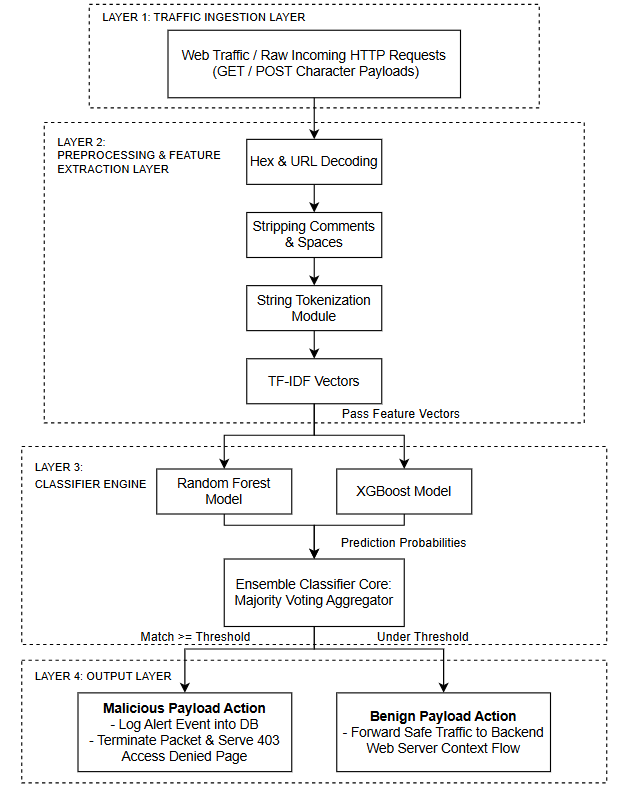
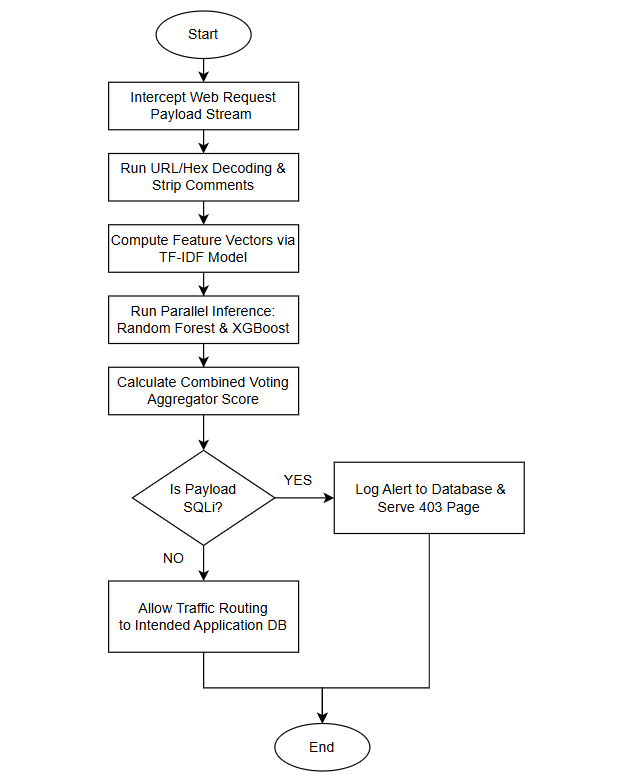

# Research Proposal for SQL Injection Detection using Ensemble Learning

## Section A: Submission Details
* **Group Number:** Group AJ
* **Assigned Research Area:** Website Security (SQL Injection, XSS, CSRF, HTTPS, WAF)

| Student Name | Student ID | Primary Contribution |
| :--- | :--- | :--- |
| [Your Name] | [Your ID] | Chapter 3 (Part A): Methodology selection, Development Model, Architecture Diagram, System Flowchart, and Repository Organization. |
| Hafiz Hakimi Mazuki | Hafiz04 | Chapter 2: Literature Review, synthesis of previous studies, summary table, and research gap analysis. |
| [Member 3 Name] | [Member 3 ID] | Chapter 1: Introduction, Problem Statements, Research Objectives, Scope, and Significance. |
| [Member 4 Name] | [Member 4 ID] | Chapter 3 (Part B): Data Collection, Evaluation Plan, Timeline/Gantt Chart, and Expected Outcomes. |

---

## 1. Project Overview
### 1.1 Research Problem
* **Problem 1 (Evasion Tactics):** Traditional signature-based Web Application Firewalls (WAFs) fail to detect heavily obfuscated SQL Injection (SQLi) attacks, leading to high false-negative rates.
* **Problem 2 (Model Reliability):** Single machine learning classifiers suffer from high variance or over-fitting when dealing with dynamic and evolving web traffic payloads.

### 1.2 Research Aim and Objectives
The primary aim of this research is to propose an intelligent SQL Injection detection framework leveraging Ensemble Learning to improve accuracy and mitigate obfuscated attack patterns.
1. **RO1:** To study and analyze existing methods, techniques, and machine learning algorithms used for SQL Injection detection.
2. **RO2:** To design and develop an Ensemble Learning-based detection prototype and system architecture.
3. **RO3:** To evaluate and validate the detection performance of the proposed ensemble framework against a standard baseline payload dataset.

---

## 2. Research Methodology and Engineering Framework
### 2.1 Layer 1: Research Methodology
* **Selected Methodology:** Design Science Research Methodology (DSRM)
* **Justification:** DSRM is selected because the core contribution of this project is the construction and evaluation of a novel technical artifact—specifically, an ensemble machine learning detection pipeline—designed to solve a concrete web vulnerability challenge [0.1.5, 0.1.72, source: 2].

### 2.2 Layer 2: Development Model
* **Selected Model:** Prototyping Model
* **Justification:** Given the rigorous single-semester proposal structure, an evolutionary prototyping approach enables our team to design, evaluate, and incrementally refine the feature extraction and ensemble code models within the required timeline.

---

## 3. System Architecture and Process Flow
Below is the structural engineering layout of the proposed web SQLi detection pipeline.

### 3.1 Proposed System Architecture

### 3.2 System Flowchart

---

## 4. Repository Structure and Objective Mapping
This repository traceably maps all technical work directly back to the core Research Objectives (RO1, RO2, RO3):

* **01_Research_Papers/ and 02_Literature_Review/ (Supports RO1):** Formulates the comparison tables and details the research gap analysis.
* **03_Architecture_and_Flowchart/ and 04_Source_Code/ (Supports RO2):** Holds the engineering blueprints, tokenization scripts, and ensemble classifier configurations.
* **05_Data_or_Sample_Input/ and 06_Results_or_Expected_Output/ (Supports RO3):** Hosts sample SQLi/Benign query logs, execution baselines, and evaluation metric charts.
* **07_References/:** Consolidated project resources formatted strictly to APA style standards.

---

## 5. Target Technical Stack
* **Domain Standard Cited:** OWASP Web Security Testing Guide (WSTG)
* **Programming Languages:** Python 3.x
* **Frameworks and Libraries:** Scikit-learn (Ensemble methods), Pandas, NumPy, NLTK (string tokenization)
* **Datasets and Evaluation Metrics:** Modified Kaggle SQLi Dataset; measured via Precision, Recall, F1-Score, and False Positive Rate (FPR).
